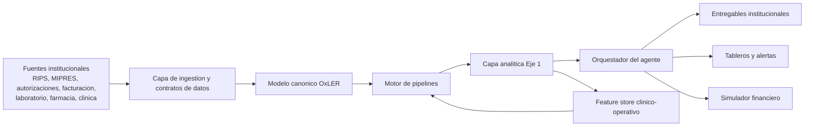

# Agente OxLER de Analitica para Gestion del Riesgo en Salud

## 1. Objetivo del producto

Construir un agente institucional de analitica para OxLER que apoye de punta a punta la gestion de cohortes, la gestion poblacional y la ciencia de datos aplicada a salud, tomando como base los siete subprocesos del Eje 1 de Gestion Inteligente del Riesgo:

1. Analisis exploratorio de cohortes.
2. Analisis de puertas de entrada.
3. Analisis de rutas por concentracion y eficiencia.
4. Analisis de indicadores de enrutamiento.
5. Analisis del mapa de flujo de valor y travesia del paciente.
6. Analisis de impacto financiero.
7. Adaptacion de la matriz de variables.

El agente no debe limitarse a contestar preguntas. Debe coordinar ingestion, validacion, analitica, generacion de hallazgos, simulacion y empaquetado de entregables para OxLER y clientes institucionales como EPS, aseguradores, prestadores integrados y redes especializadas.

## 2. Tesis de producto

OxLER necesita un copiloto institucional especializado, vertical y trazable. El valor no esta en un chatbot generico, sino en una capa de inteligencia que:

- entienda cohortes y rutas de enfermedad;
- traduzca datos heterogeneos a un modelo canonico;
- ejecute pipelines repetibles de ciencia de datos;
- convierta hallazgos en decisiones operativas y financieras;
- mantenga criterio clinico, administrativo y economico al mismo tiempo.

## 3. Usuarios y jobs to be done

| Usuario | Necesidad principal | Salida esperada |
|---|---|---|
| Lider medico OxLER | Entender riesgo real de la cohorte | Lectura clinica y priorizacion |
| Lider analitico | Orquestar pipelines y hallazgos | Plan analitico, notebooks, scorecards |
| Consultor de procesos | Redisenar puertas de entrada y rutas | Mapas de flujo, backlog de mejoras |
| Referente financiero | Estimar impacto y ROI | Escenarios de ahorro, sensibilidad |
| Cliente institucional | Tomar decisiones | Resumen ejecutivo y tablero accionable |

## 4. Arquitectura de referencia



### Componentes

| Componente | Responsabilidad |
|---|---|
| Capa de ingestion | Extraer, validar y versionar datos de clientes |
| Modelo canonico OxLER | Homologar variables y reglas del dominio |
| Motor de pipelines | Ejecutar EDA, process mining, modelos predictivos y simulacion |
| Orquestador del agente | Elegir subprocesos, secuencia y entregables |
| Capa conversacional | Traducir preguntas institucionales a planes y respuestas trazables |
| Capa de gobierno | Seguridad, auditoria, explicabilidad y aprobaciones |

## 5. Diseno funcional del agente

### 5.1 Modos de trabajo

| Modo | Cuando se usa | Resultado |
|---|---|---|
| Diagnostico de cohorte | Inicio de cliente o nueva cohorte | Perfil poblacional y mapa de calidad |
| Optimizacion de puerta de entrada | Tamizaje, sospecha, referencia, APS | Hallazgos de acceso y rediseno |
| Optimizacion de red y rutas | Fragmentacion y dispersion | Ranking de nodos y rutas objetivo |
| Monitoreo operativo | Operacion recurrente | KPIs, semaforos y alertas |
| Simulacion financiera | Decisiones de red, tecnologia o proceso | Escenarios de impacto |
| Factory de ciencia de datos | Nuevos modelos o experimentos | Pipelines reproducibles y deployables |

### 5.2 Secuencia operativa

1. Recibir una solicitud institucional con cohorte, objetivo y horizonte de decision.
2. Validar disponibilidad de datos y madurez del cliente.
3. Mapear fuentes al modelo canonico.
4. Seleccionar subprocesos del Eje 1 necesarios para el caso.
5. Activar pipelines analiticos correspondientes.
6. Generar hallazgos con etiqueta confirmatorio, exploratorio o incierto.
7. Traducir hallazgos a backlog operativo, scorecards y caso de negocio.
8. Persistir trazabilidad de datasets, reglas, prompts y resultados.

## 6. Mapeo de los subprocesos al agente

| Subproceso | Modulo del agente | Tecnicas principales | Entregable clave |
|---|---|---|---|
| 1.1 Cohortes | `cohort_profiling` | EDA, reglas de calidad, segmentacion | Ficha tecnica y baseline |
| 1.2 Puertas de entrada | `entry_flow_anomaly_detection` | Analisis secuencial, anomalias, time-to-event | Mapa de ingreso |
| 1.3 Rutas y eficiencia | `route_efficiency_engine` | Grafos, scoring de nodos, concentracion | Ranking de red |
| 1.4 Enrutamiento | `routing_kpi_monitor` | KPI store, reglas, alertas | Scorecards |
| 1.5 Flujo de valor | `patient_journey_mapper` | Process mining, bottlenecks | Journey map |
| 1.6 Impacto financiero | `financial_impact_simulator` | Cost attribution, escenarios | Caso de negocio |
| 1.7 Matriz de variables | `canonical_data_model_pipeline` | Data contracts, schema mapping | Diccionario canonico |

## 7. Modelo de datos minimo

### Dominios minimos

- `cohort`: identificacion, inclusion, corte, territorialidad, aseguramiento.
- `clinical`: diagnostico, estadificacion, comorbilidad, tratamiento, desenlaces.
- `operations`: fechas, autorizaciones, remisiones, activacion, nodos, transiciones.
- `finance`: costo, facturacion, tecnologia, PMPM, eventos de alto impacto.
- `network`: prestador, nivel, region, capacidad y resolutividad.

### Contratos obligatorios

- Identificador unico de paciente pseudonimizado.
- Fecha de corte del dataset.
- Fuente de origen trazable por registro o lote.
- Version del diccionario de variables.
- Reglas de inclusion y exclusion de cohorte.
- Definicion de eventos clave: sospecha, confirmacion, remision, ingreso efectivo.

## 8. Pipelines de ciencia de datos

### 8.1 Pipelines fundacionales

| Pipeline | Objetivo | Frecuencia |
|---|---|---|
| Canonical Data Model | Homologacion y calidad | Onboarding + validacion recurrente |
| Cohort Profiling | Baseline y segmentacion | Diario o semanal |
| Routing KPI Monitor | Operacion y alertas | Intradiario o diario |

### 8.2 Pipelines avanzados

| Pipeline | Objetivo | Tecnicas sugeridas |
|---|---|---|
| Entry Flow Anomaly Detection | Detectar fallas tempranas | Isolation Forest, secuencias, time-to-event |
| Route Efficiency Engine | Medir dispersion y concentracion | Grafos, scoring de red, clustering |
| Patient Journey Mapper | Identificar desperdicios | Process mining y bottleneck analytics |
| Financial Impact Simulator | Cuantificar ROI | Escenarios, sensibilidad, Monte Carlo ligero |
| Risk Stratification Model | Priorizar pacientes | Survival, boosting, calibration |

## 9. Arquitectura del agente de IA

### Agentes especializados recomendados

| Agente | Rol | Herramientas |
|---|---|---|
| Intake Agent | Entender solicitud institucional | Formularios, contratos de datos |
| Data Steward Agent | Validar calidad y homologacion | Reglas, profiling, data contracts |
| Cohort Analytics Agent | Perfilamiento y segmentacion | SQL, Python, notebooks |
| Flow Intelligence Agent | Rutas, puertas y journey | Process mining, grafos |
| Financial Agent | Simulacion y costo-efectividad | Modelos financieros |
| Report Agent | Narrativa ejecutiva | Templates, markdown, PowerPoint |

### Patron de orquestacion

- Un orquestador central decide que subprocesos ejecutar.
- Cada subagente responde con artefactos estructurados, no solo texto libre.
- La conversacion con el usuario se alimenta de evidencias persistidas.
- Todo output institucional debe poder reconstruirse desde datasets y reglas versionadas.

## 10. Gobierno, seguridad y cumplimiento

- Minimizar PHI y usar pseudonimizacion por defecto.
- Control de acceso por rol y por cliente.
- Logs de auditoria para consultas, descargas y recomendaciones.
- Versionamiento de datasets, modelos y prompts.
- Aprobacion medico-analitica para recomendaciones de alto impacto.
- Separacion estricta entre entorno OxLER y entornos por cliente institucional.
- Politica clara de no automatizar decisiones de cobertura o tratamiento sin supervision humana.

## 11. Roadmap de implementacion

### Fase 1. MVP vertical

- Una cohorte priorizada.
- Modelo canonico minimo.
- Subprocesos 1.1, 1.2, 1.6 y 1.7.
- Tablero base y reporte ejecutivo.
- Simulacion financiera inicial.

### Fase 2. Operacionalizacion

- Subprocesos 1.3, 1.4 y 1.5.
- Alertas operativas y scorecards recurrentes.
- Feature store y trazabilidad completa.
- Integracion con BI institucional.

### Fase 3. Escalamiento

- Multiples cohortes y clientes.
- Catalogo reutilizable de pipelines.
- MLOps para modelos de estratificacion y anomalias.
- Marketplace interno de plantillas de analitica OxLER.

## 12. Stack sugerido

| Capa | Recomendacion |
|---|---|
| Ingestion | Python + SQL + conectores batch |
| Orquestacion de datos | Prefect o Dagster |
| Transformaciones | dbt o capa SQL versionada |
| Analitica | Python, pandas, scikit-learn, lifelines, networkx, pm4py |
| Serving de modelos | FastAPI |
| LLM / agente | OpenAI API con herramientas y retrieval controlado |
| Observabilidad | MLflow, OpenTelemetry, auditoria propia |
| BI | Power BI, Metabase o frontend OxLER |

## 12.1 Modulo de analitica general

El workspace ahora incluye un modulo transversal de analitica general para que OxLER o clientes institucionales puedan entrenar modelos supervisados tabulares sin depender del caso oncologico. Este modulo sirve para:

- clasificacion binaria o multiclase;
- regresion tabular;
- comparacion automatica de varios candidatos;
- seleccion del mejor modelo segun una metrica objetivo;
- preprocesamiento automatico de variables numericas y categoricas;
- soporte para datasets `csv` y `xlsx`.

### Librerias y estrategia de eleccion de modelo

- Engine actual: `scikit-learn` como backend principal.
- Seleccion automatica: leaderboard entre regresion logistica, random forest, extra trees y gradient boosting para clasificacion; ridge, random forest, extra trees y gradient boosting para regresion.
- Preprocesamiento: imputacion, escalamiento y one-hot encoding.
- Soporte Excel: `openpyxl`.
- Dependencia opcional: instalar con `pip install -e .[ml]`.

### Casos de uso esperados

- prediccion de riesgo;
- clasificacion de adherencia o no adherencia;
- probabilidad de evento de alto costo;
- priorizacion operativa;
- estimacion de costo o consumo futuro.

## 13. Artefactos incluidos en este workspace

- [pyproject.toml](/Users/oxler/Documents/New%20project/pyproject.toml)
- [agent.py](/Users/oxler/Documents/New%20project/src/oxler_risk_agent/agent.py)
- [contracts.py](/Users/oxler/Documents/New%20project/src/oxler_risk_agent/contracts.py)
- [general_analytics.py](/Users/oxler/Documents/New%20project/src/oxler_risk_agent/general_analytics.py)
- [general_analytics_cli.py](/Users/oxler/Documents/New%20project/src/oxler_risk_agent/general_analytics_cli.py)
- [models.py](/Users/oxler/Documents/New%20project/src/oxler_risk_agent/models.py)
- [oncology_pipeline.py](/Users/oxler/Documents/New%20project/src/oxler_risk_agent/oncology_pipeline.py)
- [subprocesses.py](/Users/oxler/Documents/New%20project/src/oxler_risk_agent/subprocesses.py)
- [pipeline_factory.py](/Users/oxler/Documents/New%20project/src/oxler_risk_agent/pipeline_factory.py)
- [cli.py](/Users/oxler/Documents/New%20project/src/oxler_risk_agent/cli.py)
- [api_main.py](/Users/oxler/Documents/New%20project/src/oxler_risk_agent/api_main.py)
- [test_risk_agent.py](/Users/oxler/Documents/New%20project/tests/test_risk_agent.py)
- [oncology_canonical_contract.json](/Users/oxler/Documents/New%20project/data_contracts/oncology_canonical_contract.json)
- [oncology_cohort_schema.json](/Users/oxler/Documents/New%20project/schemas/oncology_cohort_schema.json)
- [oncology_sample_cohort.csv](/Users/oxler/Documents/New%20project/examples/oncology_sample_cohort.csv)
- [churn_risk_sample.csv](/Users/oxler/Documents/New%20project/examples/general_analytics/churn_risk_sample.csv)
- [churn_risk_sample.xlsx](/Users/oxler/Documents/New%20project/examples/general_analytics/churn_risk_sample.xlsx)
- [churn_risk_request.json](/Users/oxler/Documents/New%20project/examples/general_analytics/churn_risk_request.json)

## 13.1 Uso rapido del MVP oncologico

### Generar un plan del agente

```bash
PYTHONPATH=src python -m oxler_risk_agent.cli examples/oncology_eps_request.json
```

### Perfilar una cohorte oncologica en CSV

```bash
PYTHONPATH=src python - <<'PY'
from oxler_risk_agent.oncology_pipeline import profile_oncology_cohort
result = profile_oncology_cohort("examples/oncology_sample_cohort.csv")
print(result.to_markdown())
PY
```

### Mapear un archivo crudo del cliente al formato canonico OxLER

```bash
PYTHONPATH=src python - <<'PY'
from oxler_risk_agent.oncology_mapping import map_oncology_csv
result = map_oncology_csv(
    "examples/oncology_raw_source.csv",
    "examples/oncology_source_mapping.json",
    "outputs/oncology_mapped_from_raw.csv",
)
print(result.to_dict())
PY
```

Luego ese archivo canonico ya puede pasar por el pipeline de perfilamiento:

```bash
PYTHONPATH=src python - <<'PY'
from oxler_risk_agent.oncology_pipeline import profile_oncology_cohort
result = profile_oncology_cohort("outputs/oncology_mapped_from_raw.csv")
print(result.to_markdown())
PY
```

### Analizar puertas de entrada oncologicas

```bash
PYTHONPATH=src python - <<'PY'
from oxler_risk_agent.oncology_entry_flow import analyze_oncology_entry_flow
result = analyze_oncology_entry_flow("outputs/oncology_mapped_from_raw.csv")
print(result.to_markdown())
PY
```

### Estimar impacto financiero oncologico

```bash
PYTHONPATH=src python - <<'PY'
from oxler_risk_agent.oncology_financial_impact import analyze_oncology_financial_impact
result = analyze_oncology_financial_impact("outputs/oncology_mapped_from_raw.csv")
print(result.to_markdown())
PY
```

### Revisar capacidades del modulo de analitica general

```bash
PYTHONPATH=src python - <<'PY'
from oxler_risk_agent.general_analytics import detect_general_analytics_capabilities
print(detect_general_analytics_capabilities())
PY
```

### Previsualizar un dataset para modelado

```bash
PYTHONPATH=src python - <<'PY'
from oxler_risk_agent.general_analytics import preview_dataset_columns
print(preview_dataset_columns("examples/general_analytics/churn_risk_sample.csv"))
PY
```

Tambien funciona con Excel:

```bash
PYTHONPATH=src python - <<'PY'
from oxler_risk_agent.general_analytics import preview_dataset_columns
print(preview_dataset_columns("examples/general_analytics/churn_risk_sample.xlsx"))
PY
```

### Entrenar un modelo automatico general

Primero instalar el extra de ML:

```bash
pip install -e .[ml]
```

Luego ejecutar el request de ejemplo:

```bash
PYTHONPATH=src python -m oxler_risk_agent.general_analytics_cli examples/general_analytics/churn_risk_request.json
```

### Generar un report pack auditable del entrenamiento

```bash
PYTHONPATH=src python -m oxler_risk_agent.general_analytics_cli \
  examples/general_analytics/churn_risk_request.json \
  outputs/general_analytics_churn_pack
```

Ese pack deja cinco artefactos listos para trazabilidad y despliegue:

- `result.json`
- `result.md`
- `request.json`
- `manifest.json`
- `model.joblib`

### Generar predicciones con el modelo serializado

```bash
PYTHONPATH=src python -m oxler_risk_agent.general_analytics_cli predict \
  outputs/general_analytics_churn_pack/model.joblib \
  examples/general_analytics/churn_risk_sample.csv \
  outputs/general_analytics_churn_predictions.csv
```

Tambien puedes generar salida en Excel:

```bash
PYTHONPATH=src python -m oxler_risk_agent.general_analytics_cli predict \
  outputs/general_analytics_xlsx_pack/model.joblib \
  examples/general_analytics/churn_risk_sample.xlsx \
  outputs/general_analytics_churn_predictions.xlsx
```

### Levantar la API del MVP

Primero instalar el extra web:

```bash
pip install -e .[api]
```

Luego iniciar el servidor:

```bash
uvicorn oxler_risk_agent.api_main:app --app-dir src --reload
```

Endpoints iniciales:

- `GET /health`
- `GET /contracts/oncology`
- `GET /analytics/general/capabilities`
- `POST /agent/plan`
- `POST /analytics/general/preview`
- `POST /analytics/general/report-pack`
- `POST /analytics/general/predict`
- `POST /analytics/general/train`
- `POST /pipelines/oncology/map`
- `POST /pipelines/oncology/entry-flow`
- `POST /pipelines/oncology/financial-impact`
- `POST /pipelines/oncology/profile`

## 14. Siguiente paso recomendado para OxLER

Tomar una cohorte piloto y construir el primer contrato de datos institucional con cuatro fuentes: base de pacientes, RIPS, autorizaciones y costos. Con eso se puede levantar una primera version productiva del agente para un cliente, enfocada en puertas de entrada, baseline de cohorte e impacto financiero, que son las zonas donde mas rapido se materializa valor de negocio.
